# Manual do Usuário - nORM

Manual completo para uso da plataforma nORM (Next Online Reputation Manager).

## Índice

1. [Primeiros Passos](#primeiros-passos)
2. [Dashboard](#dashboard)
3. [Gerenciar Clientes](#gerenciar-clientes)
4. [Configurar Palavras-chave](#configurar-palavras-chave)
5. [Monitoramento](#monitoramento)
6. [Alertas](#alertas)
7. [Geração de Conteúdo](#geração-de-conteúdo)
8. [Relatórios](#relatórios)
9. [Configurações](#configurações)

---

## Primeiros Passos

### Acessar a Plataforma

1. Acesse o endereço da plataforma
2. Faça login com suas credenciais
3. Você será redirecionado para o Dashboard


### Primeira Configuração

Após o primeiro acesso:

1. Crie seu primeiro cliente
2. Adicione palavras-chave para monitoramento
3. Configure contas de redes sociais (opcional)
4. Aguarde a primeira coleta de dados (até 6 horas)

---

## Dashboard

O Dashboard é a tela principal da plataforma. Mostra:

- **Score de Reputação**: Número de 0 a 100
- **Alertas Críticos**: Quantidade de alertas não resolvidos
- **Volume de Menções**: Total de menções encontradas
- **Conteúdo Gerado**: Artigos criados pela IA
- **Alertas Recentes**: Últimos alertas do sistema

### Entendendo o Score

O score varia de 0 a 100:

```
0-30   = Crítico (reputação muito negativa)
31-50  = Baixo (reputação negativa)
51-70  = Médio (reputação neutra)
71-85  = Bom (reputação positiva)
86-100 = Excelente (reputação muito positiva)
```

### Fórmula do Score


O sistema calcula automaticamente o score baseado em:
- Posição média no Google (35%)
- Sentimento das notícias (25%)
- Sentimento das redes sociais (20%)
- Tendência (subindo/descendo) (15%)
- Volume de menções (5%)

---

## Gerenciar Clientes

### Criar Novo Cliente

1. Clique em **"Clientes"** no menu
2. Clique em **"Novo Cliente"**
3. Preencha os dados:
   - Nome do cliente
   - Indústria/Setor
   - Website (opcional)
4. Clique em **"Salvar"**


### Editar Cliente

1. Acesse **"Clientes"**
2. Clique no cliente desejado
3. Clique em **"Editar"**
4. Faça as alterações
5. Clique em **"Salvar"**

### Excluir Cliente

1. Acesse **"Clientes"**
2. Clique no cliente desejado
3. Clique em **"Excluir"**
4. Confirme a exclusão

**Atenção**: Excluir um cliente remove todos os dados relacionados (palavras-chave, alertas, histórico).

---

## Configurar Palavras-chave

### Adicionar Palavra-chave

1. Acesse o cliente
2. Vá em **"Configurações"**
3. Clique em **"Adicionar Palavra-chave"**
4. Digite a palavra-chave
5. Configure o limite de alerta (opcional)
6. Clique em **"Salvar"**

### Limite de Alerta

O limite de alerta define quando você será notificado:

```
Limite = 5 significa:
- Se a palavra-chave cair 5 ou mais posições
- Um alerta será gerado automaticamente
```

### Exemplo de Configuração

```
Cliente: Empresa XYZ
Palavras-chave:
  - "empresa xyz"
  - "xyz serviços"
  - "xyz reclamações"
  - "xyz avaliações"
```


---

## Monitoramento

### Como Funciona

O sistema monitora automaticamente:

1. **Google (SERP)**: Posições das palavras-chave
2. **Google News**: Notícias sobre o cliente
3. **Redes Sociais**: Instagram, LinkedIn, Facebook
4. **Análise de Sentimento**: Positivo, neutro ou negativo

### Frequência de Coleta

```mermaid
gantt
    title Frequência de Monitoramento
    dateFormat HH:mm
    section SERP
    Verificação SERP    :active, serp, 00:00, 6h
    section Social
    Sincronização Social :active, social, 00:00, 6h
    section Notícias
    Scraping Notícias   :active, news, 08:00, 24h
    section Reputação
    Cálculo Score       :active, score, 00:00, 24h
```



- **SERP**: A cada 6 horas
- **Redes Sociais**: A cada 6 horas
- **Notícias**: Diariamente às 8h
- **Score**: Diariamente à meia-noite

### Ver Resultados

1. Acesse o cliente
2. Vá em **"Monitoramento"**
3. Veja:
   - Posições atuais no Google
   - Últimas menções
   - Análise de sentimento
   - Gráficos de tendência

---

## Alertas

### Tipos de Alertas

O sistema gera alertas automáticos para:

- **Mudança de Posição SERP**: Palavra-chave caiu no ranking
- **Conteúdo Negativo**: Menção com sentimento negativo detectada
- **Aumento de Menções**: Volume de menções aumentou significativamente
- **Score em Queda**: Score de reputação caiu

### Severidade dos Alertas

```
Crítico  = Requer ação imediata
Alto     = Importante, ação em breve
Médio    = Atenção necessária
Baixo    = Informativo
```

### Receber Alertas

Os alertas são enviados por:

1. **Email**: Notificação automática
2. **Dashboard**: Aparecem na tela principal
3. **Página de Alertas**: Lista completa

### Resolver Alerta

1. Acesse **"Alertas"**
2. Clique no alerta
3. Leia os detalhes
4. Clique em **"Marcar como Resolvido"**


---

## Geração de Conteúdo

### Como Funciona

A IA gera automaticamente artigos otimizados para SEO quando:

- Conteúdo negativo é detectado
- Score de reputação cai
- Você solicita manualmente

### Solicitar Geração Manual

1. Acesse **"Conteúdo"**
2. Clique em **"Gerar Novo Artigo"**
3. Selecione o cliente
4. Escolha o tema (opcional)
5. Clique em **"Gerar"**

### Processo de Geração


### Artigos Gerados

Para cada solicitação, a IA gera:

- **3 a 5 artigos** diferentes
- **800 a 1500 palavras** cada
- **Otimizados para SEO**
- **Publicados como rascunhos** no WordPress

### Revisar e Publicar

1. Acesse **"Conteúdo"**
2. Veja os artigos gerados
3. Clique em **"Revisar"**
4. Faça ajustes se necessário
5. Clique em **"Publicar"** (ou mantenha como rascunho)

---

## Relatórios

### Exportar Dados

Você pode exportar dados em CSV:

1. Acesse a seção desejada (Clientes, Alertas, Reputação)
2. Clique em **"Exportar"**
3. O arquivo CSV será baixado

### Dados Disponíveis para Exportação

- **Clientes**: Lista completa de clientes
- **Alertas**: Alertas com filtros (status, severidade, período)
- **Scores**: Histórico de scores de reputação

### Visualizar Gráficos

No Dashboard você encontra:

- **Evolução do Score**: Gráfico de linha mostrando tendência
- **Distribuição de Sentimento**: Gráfico de pizza
- **Volume de Menções**: Gráfico de barras
- **Posições SERP**: Tabela com histórico


---

## Configurações

### Perfil do Usuário

1. Clique no seu nome (canto superior direito)
2. Selecione **"Configurações"**
3. Edite:
   - Nome
   - Email
   - Preferências de notificação

### Notificações

Configure como receber alertas:

- **Email**: Receber por email
- **Push**: Notificações no navegador (requer permissão)
- **Dashboard**: Apenas no dashboard

### Integrações

#### WordPress

1. Acesse **"Configurações"** > **"WordPress"**
2. Adicione o site WordPress:
   - URL do site
   - Usuário
   - Senha (criptografada)
3. Teste a conexão
4. Salve

#### Redes Sociais

1. Acesse **"Configurações"** > **"Redes Sociais"**
2. Conecte as contas:
   - Instagram (via Meta)
   - LinkedIn
   - Facebook
3. Autorize o acesso
4. Salve


---

## Perguntas Frequentes

### Quanto tempo leva para começar a monitorar?

Após configurar um cliente e palavras-chave, a primeira coleta acontece em até 6 horas.

### Com que frequência os dados são atualizados?

- SERP e Redes Sociais: A cada 6 horas
- Notícias: Diariamente
- Score: Diariamente

### Posso monitorar quantos clientes?

Não há limite. Você pode monitorar quantos clientes precisar.

### Os artigos gerados são publicados automaticamente?

Não. Os artigos são publicados como **rascunhos** no WordPress para você revisar antes de publicar.

### Como o sistema detecta conteúdo negativo?

O sistema usa IA (GPT-4) para analisar o sentimento de cada menção encontrada, classificando como positivo, neutro ou negativo.

### O que fazer quando receber um alerta crítico?

1. Leia os detalhes do alerta
2. Verifique a fonte (link fornecido)
3. Se necessário, gere conteúdo positivo
4. Monitore a evolução
5. Marque como resolvido quando tratar

---

## Suporte

### Precisa de Ajuda?

- **Documentação**: Consulte os guias em `docs/`
- **Issues**: Reporte problemas no GitHub
- **Email**: Entre em contato com o suporte

### Glossário

- **SERP**: Search Engine Results Page (página de resultados do Google)
- **Score**: Pontuação de reputação (0-100)
- **Sentimento**: Análise de tom (positivo/neutro/negativo)
- **Menção**: Qualquer referência ao cliente encontrada online
- **RLS**: Row Level Security (segurança no banco de dados)

---

**Última atualização**: 2025-01-03
